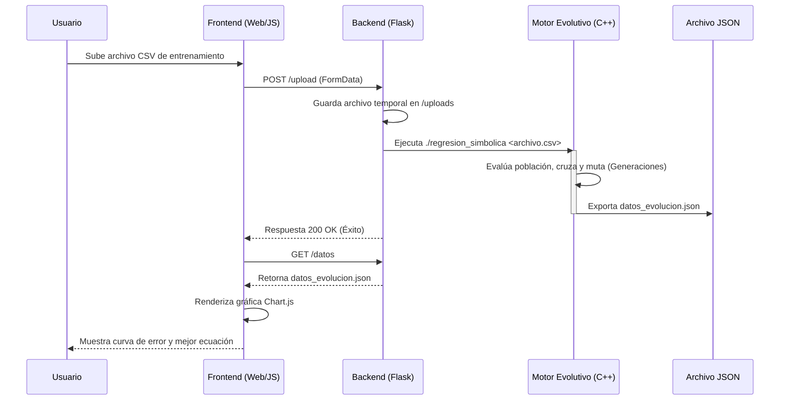

# Arquitectura del Sistema: Motor de Regresión Simbólica

Este documento describe la estructura técnica y el flujo de datos del proyecto, diseñado bajo un esquema híbrido que separa el cómputo de alto rendimiento de la visualización web.

## 1. Diagrama de Arquitectura

El sistema se compone de tres capas principales que interactúan de forma asíncrona. A continuación, se detalla el flujo de la información desde la carga de datos hasta la renderización de resultados:

## 2. Descripción de Componentes

| Componente | Tecnología | Responsabilidad Técnica |
| :--- | :--- | :--- |
| **Núcleo de Cómputo** | C++17 | Ejecución de la lógica evolutiva y evaluación de fitness mediante MSE. Se hace uso intensivo de la STL y punteros inteligentes. |
| **Capa de Persistencia** | JSON | Actúa como puente de datos desacoplado, permitiendo que el backend y el frontend operen de forma independiente. |
| **Servidor de Aplicación** | Python / Flask | Provee los endpoints necesarios para servir la interfaz y orquestar la ejecución del binario de C++. |
| **Interfaz Visual** | HTML5 / Chart.js | Renderizado asíncrono de la curva de aprendizaje (error vs. generación) y presentación de resultados. |

## 3. Justificación de Decisiones Técnicas

Acorde a los requerimientos de la Línea de Especialización en Programación Matemática y Alto Rendimiento, la arquitectura se diseñó en torno a los siguientes principios:

* Gestión de Memoria y Rendimiento (C++): Se optó por C++ sobre lenguajes interpretados para el motor matemático debido a la necesidad de evaluar miles de árboles de sintaxis en milisegundos. Además de que el autor conoce un poco más el lenguaje que otras alternativas como Mojo, además Mojo al ser un proyecto relativamente nuevo, la IA no domina tanto el uso. El uso de std::unique_ptr garantiza que las ramas podadas durante la mutación se liberen de la memoria automáticamente, previniendo memory leaks (fugas de memoria) durante ejecuciones prolongadas.  

* Desacoplamiento del Cómputo y la UI: Dibujar gráficas consume valiosos ciclos de CPU. Al exportar los resultados a un archivo JSON y delegar el renderizado visual al navegador del cliente (Frontend), nos aseguramos de que el 100% de los recursos del motor C++ se destinen a la optimización matemática.

* Integración y Escalabilidad: El uso de un servidor Flask ligero como orquestador permite que el sistema cumpla con la característica de ser un "artefacto funcional" y desplegable, capaz de recibir conjuntos de datos dinámicos mediante una API REST básica.